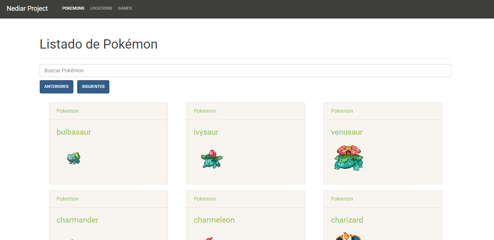

# List Pokemon



Web project built in Angular which implemented the pokeapi API to print x|the information

## Installation

---
To install to use the project:

1. git clone to project:

```
https://github.com/seObando19/List_pokemons.git
```

2. Install the dependencies:

* Frontend:

1. Change to directory:

```
cd frontend
```

2. Install dependencies:

```
npm install
```

3. Run to de front:

```
ng serve --open
```
## Author

Sebastian Obando Perez

Fullstack Sofware Developer

[LinkedIn](https://www.linkedin.com/in/sebastianobandop/)

[Github](https://github.com/seObando19/)

[Email](mailto:sebastiano-10@hotmail.com)

[Twitter](https://twitter.com/seObando19)
